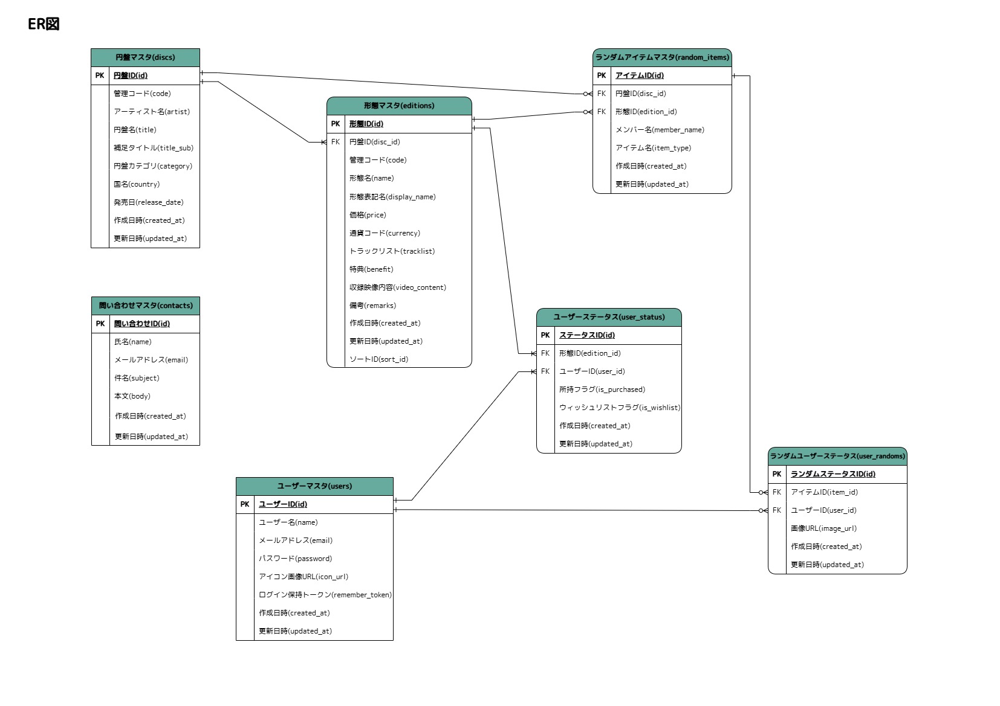

# SHINee Collection Tracker v2.0 💎

SHINeeのCD・グッズコレクションを管理・可視化するためのWebアプリケーションです。
Spring Boot(Java)版でのプロトタイプ開発を経て、実用性とユーザー体験、保守性を大幅に向上させたリプレイス版として開発しました。

---
### 🔗 関連リポジトリ
- **[Spring Boot(Java)版 v1.0 プロトタイプはこちら](https://github.com/xinobu1787/shinee-collection-tracker)**
  ※本リポジトリは、上記プロトタイプをベースに全機能をリプレイスした「Version 2.0」です。

---

## 🌟 主な機能

### 1. 圧倒的なデータ網羅率を誇る「トラッカーページ」
- **詳細データの保持**: SHINeeのグループ作品から各ソロ活動まで、形態別のトラックリスト・当時の価格・特典内容を完全に網羅。
- **直感的な操作**: タップ一つで所持未所持の切り替えと、ウィッシュリストへの登録解除が可能。ファンが手軽にコレクションを記録できるUIを追求。

### 2. 進捗を可視化する「マイページ」
- **ダッシュボード**: 全体の収集率をプログレスバーで表示。
- **パーソナライズ表示**: 自分が登録したウィッシュリストや、ランダムアイテム管理で登録した画像を、メンバー別に一覧で閲覧可能。

### 3. 未所持も把握できる「ランダム管理ページ」
- **マスタ検索・登録**: 特典のランダム品のマスタから、持っているものを検索・登録。
- **画像管理**: 自分が手に入れたアイテムの画像をアップロードし、視覚的にコレクションを管理。

### 4. ユーザーサポート（問い合わせ・FAQ）
- **FAQ連携**: よくある質問への回答と、DBへ直接送信される問い合わせフォームを完備。実運用を想定したエラーハンドリングとバリデーションを実装。

## 🚀 SpringBoot版(v1.0)からの主要な変更・改善点

前作の課題をエンジニア視点で分析し、以下の通り大幅な刷新を行いました。

### 1. 設計・ドキュメントの整備
- **SpringBoot版**: 設計書なし。
- **Laravel版**: **各種設計書の作成（DB定義、ER図、画面遷移図、CRUD図、移行計画書等）**。開発工程を可視化し、一貫性のある実装を実現。

### 2. ユーザー別管理機能の導入
- **SpringBoot版**: ログイン機能がなく、全ユーザー共通のデータを閲覧する仕様。
- **Laravel版**: **Laravel Breeze**を採用した認証機能を実装。ユーザーごとに独立したアカウントを持てるようになり、自分専用の所持状況やウィッシュリストの保存・管理が可能に。

### 3. ランダム管理ページの高度化
- **SpringBoot版**: 自分が手動登録したアイテムのみが表示される仕様。
- **Laravel版**: **ランダムアイテムのマスタデータを構築**。絞り込み機能で選択したアイテムを一覧表示し、ひと目で分かるコレクター目線での管理機能へ進化。

### 4. 問い合わせフォームのDB連携
- **SpringBoot版**: 送信ボタンを押しても通知が出るだけのダミー機能。
- **Laravel版**: Contactsテーブルを新設。入力内容がバリデーションを経てDBへ確実に保存される実運用可能なフローへ改善。

### 5. DB設計の最適化とセキュリティ向上
- **SpringBoot版**: マスタデータ3テーブルのみ。
- **Laravel版**: ユーザー別管理機能を導入するにあたり付随するテーブルを新設。ユーザーがマスタを直接更新できない構造に分離し、**データの整合性とセキュリティを大幅に向上**。

### 6. フロントエンドの刷新 (React/Inertia.js)
- **SpringBoot版**: HTML/CSS/Vanilla JS による命令的なUI制御。
- **Laravel版**: **React + Inertia.js** を導入しコンポーネント化。SPAのような滑らかな操作感を提供しつつ、コードの保守性を飛躍的に向上。

## 🛠 技術スタック

### バックエンド
- **PHP 8.5.x / Laravel 12.50.0**
- **Supabase (PostgreSQL)**
- **Supabase Storage** (画像データの永続化)

### フロントエンド
- **React / Inertia.js**
- **Tailwind CSS** (レスポンシブ設計の徹底)

## 📊 設計ドキュメント

本プロジェクトのリプレイスにあたり、設計の整合性と保守性を担保するため、以下のドキュメントを作成しました。
詳細は [`/docs`](./docs) フォルダから確認できます。

| ファイル名 | ドキュメント名 | 内容・目的 |
| :--- | :--- | :--- |
| [00_README.pdf](./docs/00_README.pdf) | **プロジェクト概要書** | リプレイスの目的、方針、機能一覧の定義 |
| [01_table_definition.pdf](./docs/01_table_definition.pdf) | **テーブル定義書** | カラム詳細、データ型、制約、論理名の定義 |
| [02_er_diagram.pdf](./docs/02_er_diagram.pdf) | **ER図** | エンティティ間のリレーションシップの可視化 |
| [03_routing_screen_flow.pdf](./docs/03_routing_screen_flow.pdf) | **画面遷移図** | ユーザー動線とInertia.jsでのルーティング設計 |
| [04_crud_matrix.pdf](./docs/04_crud_matrix.pdf) | **CRUD図** | 各機能とDB操作（Create/Read/Update/Delete）の対応 |
| [05_data_migration_plan.pdf](./docs/05_data_migration_plan.pdf) | **移行計画書** | SpringBoot版からLaravel版へのデータ移行手順の整理 |

## 📊 データベース設計
リプレイスにあたり、SpringBoot版の設計をベースにしつつ、ユーザー別ステータス管理に対応した拡張を行いました。

## 💎 こだわりポイント

### 徹底したデータ整列ロジック
DB移植時に、自動採番等で順番が入れ替わってしまう形態マスタに対し、独自の `sort_id` を導入。手作業で215件のデータを整理し、 **SpringBoot版で構築したこだわりの表示順を、Laravel環境でも完全に再現** しました。

### 環境に依存しない開発体制
- 自宅: **Docker (Laravel Sail) / WSL2**
- 訓練校: **PHP直インストール環境**
GitHubを通じたコード共有と、環境ごとの差異（npmの有無等）を考慮した柔軟な開発フローを確立。

## 🚀 今後の展望
リプレイスによる基礎構築が完了したため、今後は以下の機能を順次実装予定です。

- 映像作品（DVD/Blu-ray）へのデータ拡張
  現在はCD（シングル・アルバム）がメインですが、映像作品のマスタデータを追加し、コレクション全体の網羅性を高めます。

- 検索・フィルタリング機能の高度化
  アイテム数が増加しても目的のデータに素早くアクセスできるよう、キーワード検索や詳細な絞り込みロジックを強化します。

- パフォーマンスの最適化
  データ取得クエリの精査やキャッシュの活用により、さらなる高速なレスポンスを目指します。